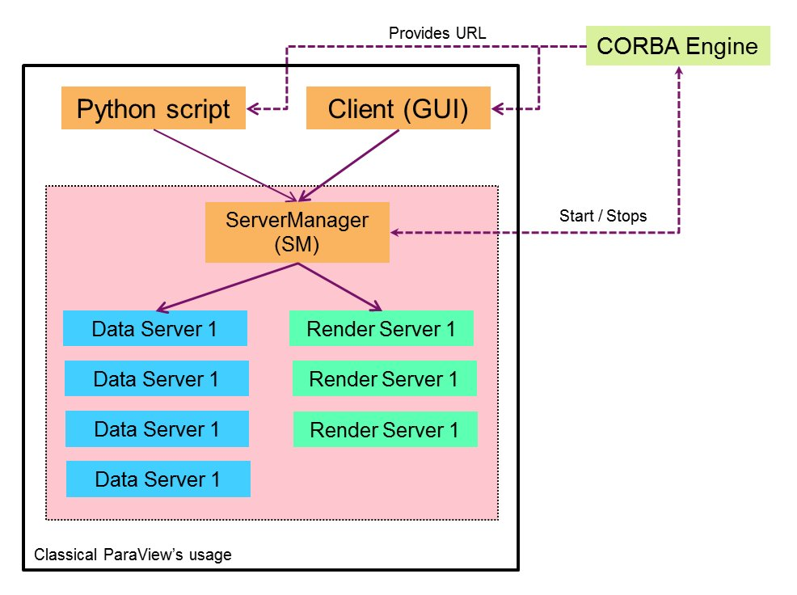

PARAVIS Module - Architecture and conception
############################################

*This documentation is intended for SALOME's developpers or anyone wishing to modify the module itself.
If you are looking for user documentation, please launch SALOME, activate the PARAVIS module, and refer 
to the Help menu there.*

PARAVIS is the visualization module of SALOME. The module is a tight integration of the functionalities
offered by ParaView in the SALOME architecture.
The architecture of the PARAVIS module has been revised end of 2014 to offer a smoother integration with ParaView.

If you are looking for the Doxygen of the C++ code, it can be found here: `Doxygen documentation <api/index.html>`_

Overview - Executive summary
%%%%%%%%%%%%%%%%%%%%%%%%%%%%

The PARAVIS module represents the integration of ParaView inside SALOME.

SALOME uses by default the *detached* server mode of ParaView: the ``pvserver`` is launched outside the main Salome process
and the ParaVis module, or the PVViewer view (Window -> ParaView view) connects to it.

Following this logic, the PVSERVER CORBA service has a very restrained role. Its only purpose is to:

* control the start and stop of the pvserver process
* provide the URL of the pvserver, so that a client can connect to it.

Hence, we emphazise the fact that the CORBA engine does *not* provide any access to the objects or the visualisation 
results themselves. It only serves to establish the link with the ``pvserver``. The latter can then be queried (with 
the standard ParaView mechanisms) to retrieve those objects.   

A typical session looks like this:

* start SALOME's GUI
* request activation of PARAVIS (or request activation of a *Paraview's View*)
	* activation of the PVSERVER CORBA service
	* invokation of the method ``FindOrStartPVServer()``: launches the pvserver process and returns its URL
	  (in the standard ParaView's format, e.g. ``cs://localhost:11111``)
	* invokation of the standard ParaView's API to connect to the pvserver (e.g. ``Connect()`` method in the 
	  Python module ``paraview.simple``)
* use the standard ParaView's API to interact with the server (either from the C++ side, within SALOME's GUI
  or from a Python script, using for example the methods provided in the Python module ``pvsimple``). 

The picture below summarizes the architecture:

In terms of code structure, the main, all the initialization logic of ParaView is attached to the ``PVViewer``
(ParaView's viewer) located in the GUI module in the **src/PVViewer** folder. 
The CORBA engine and the graphical interface of the ParaVis module are located in the ParaVis module of SALOME.

Functionalities
%%%%%%%%%%%%%%%

The following functionalities are offered by the PVSERVER and the ParaVis module:

* full embedding of ParaView's functionalities inside SALOME environment
* manage ParaVis GUI and ParaView server data from Python scripts in synchronized mode.
* compatibility of the Python scripting interface with the ``paraview.simple`` and the ``paraview.servermanager`` 
  modules.

Folder structure
%%%%%%%%%%%%%%%%

ParaVis module
==============

In the ParaVis module, here is the list of code folders:

* **idl**: contains the IDL for the PVSERVER CORBA service
* **src/ENGINE**: implementation of the IDL's functionalities in Python. Mainly deal with the start/stop of the pvserver
* **src/Plugins**: SALOME's specific plugins for ParaView: MEDReader, etc ...
* **src/PVGUI**: graphical elements constituing the ParaVis client in the SALOME GUI. Management of the menus, the toolbars,
  etc ... seen in PARAVIS interface.
* **src/PV_SWIG**: Python modules to be able to invoke visualization functionalities from a script

At the time of writing the PVSERVER CORBA service is sitll hosted by the ParaVis module, but it should move to GUI
to be able to compile GUI without any dependency to PARAVIS. At present, this is only a weak dependency in the sense
that nothing is needed at link time, but only at run-time. 

GUI module
==========

One can request a ParaView view without activating the ParaVis module itself. For example the MED module now integrates
a control visualization which is in fact a ParaView view.

To make this work, a specific type of viewer (*PVViewer*, short for ParaView viewer) has been created in the GUI module itself.
The code is located in **src/PVViewer**. 

This folder contains the following classes:

* ``PVViewer_Behaviors``: re-instanciates the desired ParaView behaviors (a behavior defines for example the fact that ParaView
  should automatically reconnect to the server if a disconnection occurs) 
* ``PVViewer_EngineWrapper``: encapsulates the calls to the PVSERVER CORBA service in a dynamic fashion, so that GUI can be
  compiled without having a link dependency to the ParaVis module 
* ``PVViewer_GUIElements``: see :ref:`view_part`
* ``PVViewer_LogWindowAdapter``: an adapter to redirect VTK and ParaView's output messages to the SALOME's message 
  window (not working?)

The folder also contain the adaptor classes needed to make the ParaView 
native 3D view (a ``pqTabbedMultiViewWidget``) fit into the *SUIT*
model (i.e. the model imposed by SALOME's GUI architecture to define a new type of view):

* ``PVViewer_ViewManager``: this class centralizes all the initialization logic (see method ``ParaviewInitApp``) of the
  ParaView application (``pqCoreApplication``).
* ``PVViewer_ViewModel``
* ``PVViewer_ViewWindow``
 

Reminder about ParaView's architecture
%%%%%%%%%%%%%%%%%%%%%%%%%%%%%%%%%%%%%%

ParaView works in a client/server mode. In two words, a server part (the ``pvserver``) takes care of the 'intensive' 
computations (filter, etc ...) and a client part serves to control this server, and obviously visualize the final rendering.  

The ``pvserver`` represents the main visualisation server, and can be either:

* *built-in*, in which case, launching ParaView suffices to activate it automatically; 
* *detached*, in which case, one has to launch the server first (possibly on another host) and then connect
  to it from a client.

The various types of clients are:

* either the standard ParaView GUI (where the name and type of the current server can be 
  seen by looking at the top element in the pipeline widget)
* or a Python script, using for example the module ``paraview.simple`` and the ``Connect()`` method. 

Historically the pvserver was not able to receive the connections from multiple clients, but this has been changed from 
ParaView 4.0 (or was it 3.98?). Salome now exploits this feature.

.. _view_part:

Viewer part (in GUI module)
%%%%%%%%%%%%%%%%%%%%%%%%%%%

In the GUI module of SALOME, the folder **src/PVViewer** contains all the code needed to activate a minimal ParaView
3D view, without activating the ParaVis module itself. 
This folder hence deals with:

* the initialization of the ParaView application (``pqApplicationCore``)
* the initialization of ParaView's desired behaviors (class ``PVViewer_GUIElements``)
* the initialization of all the GUI elements needed for a later activation of the ParaVis interface: at the time of 
  writing the pipeline, some menus, and other elements are very hard to connect *after* having set up a 3D view. They are
  however not wanted when the user just requested a 3D view, outside the ParaVis interface. We hence create those elements
  any way, but hide them, so that we can later show them again, once the ParaVis module is activated.
  The class ``PVViewer_GUIElements`` is in charge of this.

The PVViewer follows otherwise the standard structure of a Salome's view (SUIT model).

A special trick is used to make ``PVGUI_ViewWindow`` the parent of the ``pqViewManager`` widget. 
It is created initally by ``pqMainWindowCore`` 
with the desktop as a parent, so when it is shown, a ``PVGUI_ViewWindow`` instance is passed to its ``setParent()`` method. 
In the destructor ``PVGUI_ViewWindow::~PVGUI_ViewWindow()``the parent is nullified to avoid deletion
of the ``pqViewManager`` widget (that would break the ``pqMainWindowCore`` class).

ParaVis graphical interface
%%%%%%%%%%%%%%%%%%%%%%%%%%%

The initialization of the viewer (see previous section) takes part of instantiating the most important widgets, notably:

* the pipeline
* the dynamic menus (filters and sources)
* the macros
* the Properties panel
* and finally the toolbars

All those menus are dynamic in the sense that they are automatically populated when a plugin/a configuration is loaded
(this is also they need to be connected so early by the ``PVViewer_GUIElements`` class seen before).

In the ParaVis module, the class ``PVGUI_Module`` represents the GUI client compliant with the usual architecture of
a SALOME GUI module. The implementation is split in three ``cxx`` files:

* ``PVGUI_Module.cxx``: core stuff: module initialization and activation, management of the Python trace, etc ...
* ``PVGUI_Module_actions.cxx``: creation of the Qt actions and menus
* ``PVGUI_Module_widgets.cxx``: hide/show various widgets and save/restore their positions in the main window. 

Embedded Python interpreter - Multi-threading
%%%%%%%%%%%%%%%%%%%%%%%%%%%%%%%%%%%%%%%%%%%%%

ParaView is a mono-threaded application. It also provides an embedded Python interpreter to make the Python shell work.
SALOME on the other hand is multi-threaded, and also provides an embedded Python's interpreter.

Making the two work together has often been (and still is) a painful job! 
If you run into this sort of problems, take a look at what the GIL is: 
`Global Interpreter Lock <https://wiki.python.org/moin/GlobalInterpreterLock>`_  

In Salome, the current setup is to:

* patch ParaView itself so that all calls to the Python C API are GIL safe (using ``PyGILState_Ensure``, ``PyGILState_Release``)
* have Salome's embedded Python console work in mono-threaded mode (although it is fully capable of being asynchronous).
  This is achieved in ``src/PyConsole/PyConsole_Editor.cxx`` and the initialization of the ``myIsSync`` boolean member to ``True``. 

**The last point is of crucial importance**: it basically means that all the GUI events are in a single thread.
Even without considering 

All the calls to the Python API in the rest of SALOME are (should be!) GIL safe.

The ParaView Python's trace mechanism has long been a problem, but has fortunately been rationalized thanks to the API of
ParaView providing clear methods to control the start/stop (and other options of the trace). 
This is grouped in the ``ParaViewCore/ServerManager/Core/vtkSMTrace`` class and used in the 
method ``PVGUI_Module::startTrace()``.

Python modules
%%%%%%%%%%%%%%
The modules found in **src/PV_SWIG** are mostly simple namespace forwards from the original ParaView's modules (i.e. they
redirect to the original modules):

* ``pvsimple`` is a forward of ``paraview.simple`` with little extra functionalities to make sure:
	* the connection to the correct PVSERVER is automatically established
	* that a ParaView's view is available when importing the module from the embedded Python console.  
* ``paravisSM`` is a forward of ``paraview.servermanager``. It is left mostly for backward compatibility (it used to be
  full of nasty overrides).  

Those forward/similarities are naturally intended so that a script written for pure ParaView can easily be ported 
to ParaVis. The conversion boils down to replacing ``import paraview.simple`` by ``impory pvsimple`` (with a few other
extra details of lesser importance).

Updating to a newer ParaView version
%%%%%%%%%%%%%%%%%%%%%%%%%%%%%%%%%%%%

The following items should be revised each time an upgrade to a newer ParaView version is done.
They are often a copy/paste of ParaView's source code with a slight amendment to fit SALOME's requirements.

* *initialization sequence*: currently located in GUI module, ``PVViewer_ViewManager::ParaViewInitApp()``: the following
  classes should be inspected, and compared with their equivalent in ParaView source code to see if an update is necessary:
	* ``PVViewer_ViewManager`` (GUI module): method ``ParaviewInitApp()``, ``ParaviewInitBehaviors()``, ``ParaviewLoadConfigurations()``
	  and finally ``ConnectToExternalPVServer()`` should be re-read. Their precise ordering is used in ``PVGUI_Module::initialize()``
	  and the whole sequence should be compared with what can be found in:
	  	* ``Applications/ParaView/ParaViewMainWindow.cxx``
	  	* ``CMake/branded_paraview_initializer.cxx.in``, and the method ``Initialize()``
	* ``PVViewer_Behaviors`` (GUI module): compare with ``Qt/ApplicationComponents/pqParaViewBehaviors.cxx``
* *menus and actions*: ``PVGUI_Module_widgets.cxx`` (ParaVis module) should be compared with ``Applications/ParaView/ParaViewMainWindow.cxx``
* *settings dialog box*: ``PVGUI_ParaViewSettingsPane`` (ParaVis module) should be compared with ``Qt/Components/pqSettingsDialog.h``
* *trace mechanism*: method ``PVGUI_Module::startTrace()`` should be compared with ``pqTraceReaction::start()`` in file 
  ``Qt/ApplicationComponents/pqTraceReaction.h``

Miscellaneous
%%%%%%%%%%%%%

**Trace management**

Contrary to ParaView, which can start/stop its trace at any moment, in PARAVIS the trace is activated
or deactivated for the whole session.

The trace functionality can be switched on/off in SALOME preferences dialog box, in the PARAVIS tab (main menu | Preferences...).
It contains a check box “Deactivate Trace”. By default the trace is activated. 
Change of check box state makes effect only for next session.

Also, the trace is used for the "Dump Study" functionality. But if the tracing is switched off then the "Dump Study" 
doesn't save PARAVIS module trace.

**Application options**

If it is necessary to define a spcific command line parameter for ParaView application,
then it can be defined with the help of the PARAVIS_OPTIONS environment variable. For example: ::

	export PARAVIS_OPTIONS=--server=myServer

If it is necessary to define several command line parameters, these parameters have to be separated by the “:” character.

Various TODO
%%%%%%%%%%%%

* make the PVSERVER a true CORBA service not linked to the PARAVIS module
* the PARAVIS module should be a *light* module (TODO check again why this is blocking). 

Doxygen documentation
%%%%%%%%%%%%%%%%%%%%%

If you are looking for the Doxygen of the C++ code, it can be found here: `Doxygen documentation <api/index.html>`_
